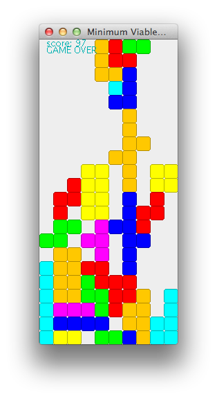

# Minimum Viable Tetris

Small project to become more familiar with Clojure

## Usage

- Up - Rotate clockwise
- Down - Hard drop
- Left/Right - Move piece

## License

Copyright © 2015

Distributed under the Eclipse Public License either version 1.0 or (at
your option) any later version.
